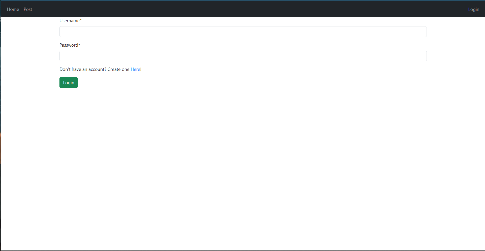

# Django-User-Management
This is my side project in order to enhance my knowlede in django user management.

The features of the website :
1. Login
2. Register
3. Post Information

I manage the user with 2 different group which are `mod` and `default`. Those Group has different permission related to the features of the website.
Those Group basically have the same accessibility such as can add post, can view post, can delete post, and can change post. What makes the `mod`
Group different is that it can delete user's post from `default` group and could ban user from default group to add a post.

This website using **PostgreSQL** database provided by Railway. To monitor the databse and add some functiona with SQL queries i use Retool to create
dashboard.

### Login Page

